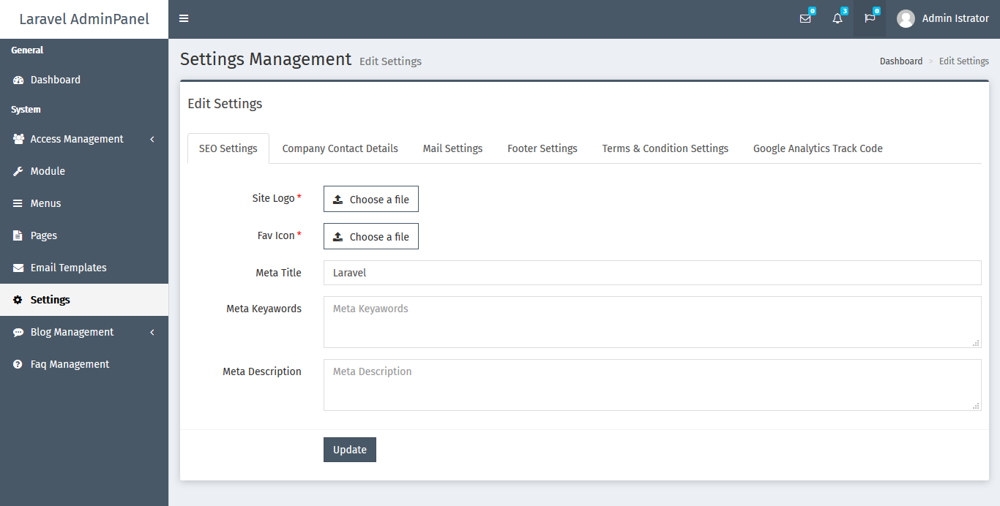

# laravel-adminpanel

## Introduction
* This is a laravel Admin Panel, based on [Rappasoft Laravel Boilerplate](https://github.com/rappasoft/laravel-5-boilerplate/releases/tag/4.5.7), with enhancemenets and many modules pre-made, just for you.

## Features
For Laravel 5 Boilerplate Features : [Features](https://github.com/rappasoft/laravel-5-boilerplate/wiki#features)

Clone the repository

    git clone https://github.com/viralsolani/laravel-adminpanel.git

Switch to the repo folder

    cd laravel-adminpanel

If you have linux system, you can execute below command only in your project root

    1) sudo chmod -R 777 install.sh
    2) ./install.sh

If you have windows system, you can run Artisan Command for database setup, connection and configuration.

    php artisan install:app

Generate a new application key

    php artisan key:generate

Generate a new JWT secret key (If you want to use API)
    php artisan jwt:secret

Generate a new JWT authentication secret key

    php artisan jwt:secret

Run the database migrations (**Set the database connection in .env before migrating**)

    php artisan migrate

Run the database seeders

    php artisan db:seed

Install the javascript dependencies using npm

    npm install

Compile the dependencies

    npm run development

For generating the files of unisharp file manager

    php artisan vendor:publish --tag=lfm_public

For linking storage folder in public

    php artisan storage:link

Start the local development server

    php artisan serve

You can now access the server at http://localhost:8000

**Command list**

    git clone https://github.com/viralsolani/laravel-adminpanel.git
    cd laravel-adminpanel
    cp .env.example .env
    composer install
    npm install
    npm run development
    php artisan storage:link
    php artisan key:generate
    php artisan jwt:secret
    php artisan vendor:publish --tag=lfm_public

## Logging In

`php artisan db:seed` adds three users with respective roles. The credentials are as follows:

* Administrator: `admin@admin.com`
* Backend User: `executive@executive.com`
* Default User: `user@user.com`

Password: `1234`

## ScreenShots

## Dashboard

## User Listing

## Settings

